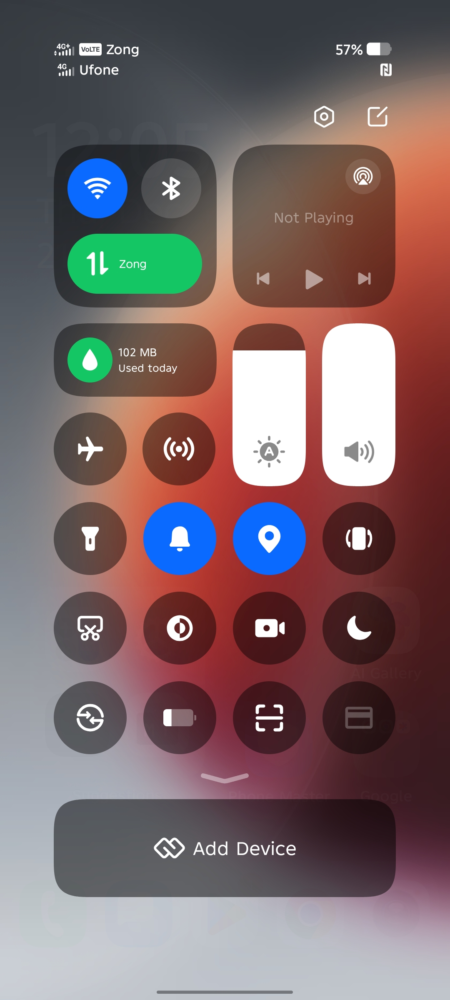
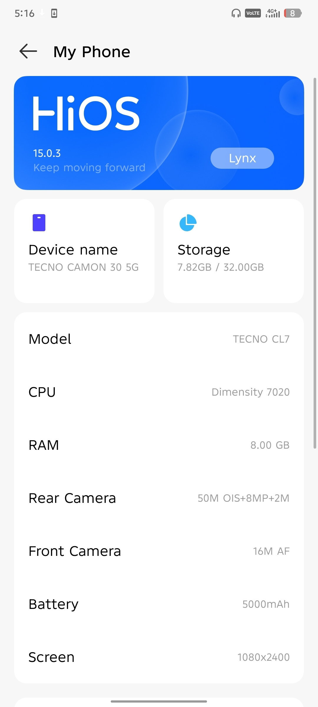
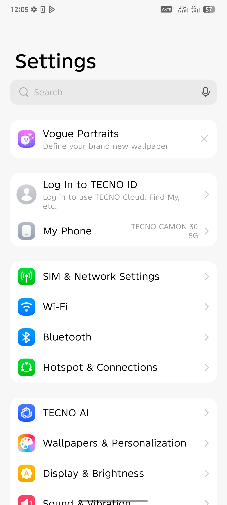
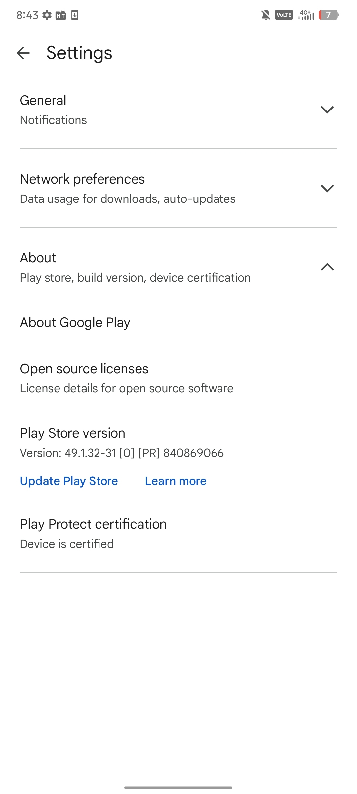
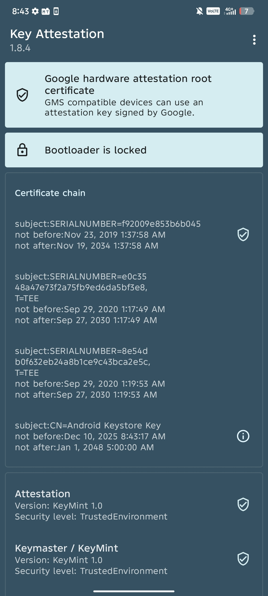
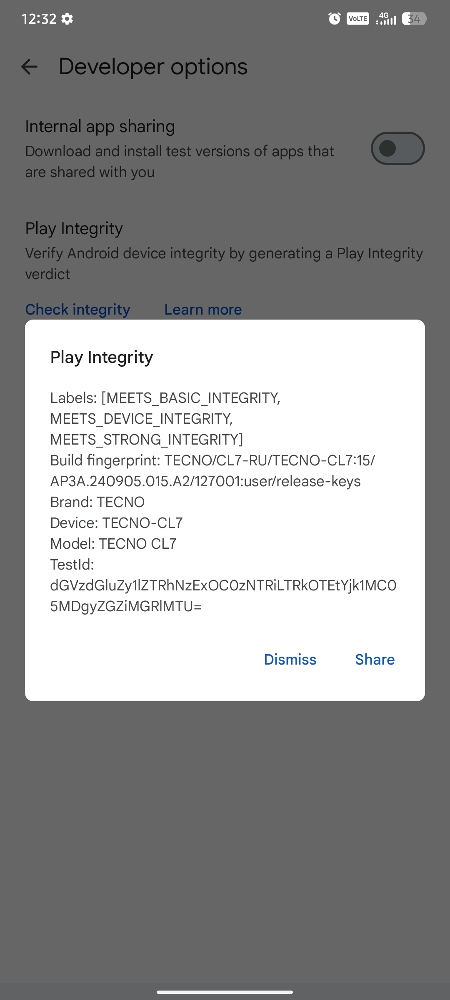

<h1 align="center">📱 HIOS 15.0.3 RU Stable – Moto G54 Port</h1>

  <b>Firmware Required:</b> V1TDS35H.83-20-5-6 
  <b>Version:</b> 15.0.3 RU Stable 

---

## ✨ **Features & Improvements**

<b>Click to expand</b>

### ✔ What’s Working
- Face Unlock (default)
- NFC (default)
- Bluetooth (default)
- SIM cards (default)

### 🚀 Enhancements
- **Removed AOD** (not needed for IPS panels)
- **Enabled Side-Mounted Fingerprint** – credit: @goupstream
- **Added Transsion Flagship (HIOS)** – credit: @nyello08
- **Enabled System-Wide Blur** – credit: @rennsproject & @nyello08
- **Flagship Animations Enabled** – credit: @rennsproject & @nyello08
- **Dolby Enabled** – credit: rama bondan & @WidyyQ
- **Preferred Network 4G/5G Enabled** – credit: me
- **Enforcing Fixed + Missing Denials Added** – credit: @nonemfck
- **Status Bar DPI Alignment Fixed** – credit: ChatGPT (overlay)
- **Fast Charging Animation Fixed** – credit: me
- **Lockscreen Wallpaper Fixed** – credit: me
- **Added 400+ SELinux Denials** – credit: @nonemfck
- **Included OrangeFox (OFOX)** – credit: @ussr_1674 (Soviet)
- **Removed HBM mode** (not needed for IPS panels)
- **removed sar support to improve wifi performance** – credit: @devhioliveira10
- **KernelSU Next patched boot Included by Default**
  - *APK still required from GitHub*
  - 
- **added Kaorios-Toolbox** – credit: @KaoriosToolbox
## ✨ Features

- ✅ Play Integrity fix  
- 🧩 Pixel & property spoofing  
- ⚙️ Per-app spoofing manager  
- ☁️ Google Photos unlimited backup  
- 🧰 Payload dumper integration  
- 🎮 Unlock high-FPS modes in games  
- 🧾 Modify application data files safely  

---

---

## 🐞 **Known Bugs**
- DT2W / R2W / ST2W *(Moto side)*

---

## 📥 **Installation Guide**

<b>Port Flashing</b>

  
### Included Firmware (V1TDS35H.83-20-5-6)
**Flashing the Port**
1. Boot into **bootloader**
2. Extract port zip
3. Run `flash.bat`
4. Follow **Preferences**
   Select:
          install **KernelSUNext** (y/N)
          Install **custom recovery** (y/N)
          Confirm **Formatdata** (y/N)
6. Wait until you see **Flashing complete** MSG then Press any key to Reboot

---

## 📡 **Credits**
Huge thanks to all contributors:

- @goupstream  
- @rennsproject  
- rama bondan  
- @WidyyQ  
- @nonemfck  
- @ussr_1674 (Soviet)  
- ChatGPT (overlay guidance)
- @KaoriosToolbox

❤️ *Community effort makes this project possible.*

---

## 💬 **Support**
For issues, discussions, or reports:  
**Join the Moto G54 Ports Telegram group**

---

---

## 📸 Screenshots

### 🛠️ Setup & 🪟 QS panel

  
  

### 🏠 Homescreen & Customization

  
  

### 🔒 Lockscreen & Animation

  
  

### 🎧 Dolby & Security

  
  

### 📶 Network & About Device

  
  

### ⚙️ Settings & play services certified 

  
  

### 🧩 Integrity & spoof

  
  

---

## 📥 Download

### 🔗 **ROM Download (HIOS 15.0.3 RU Stable)**
➡️ **[Click here to download](https://t.me/lynx_prjkt/23)**

---
